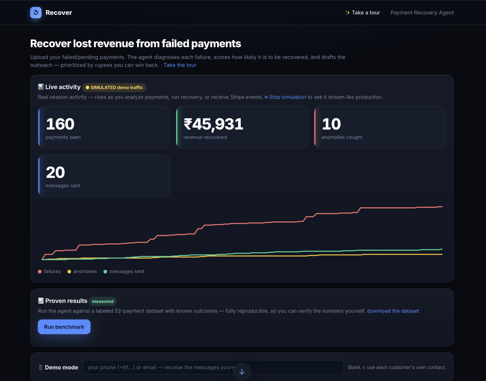
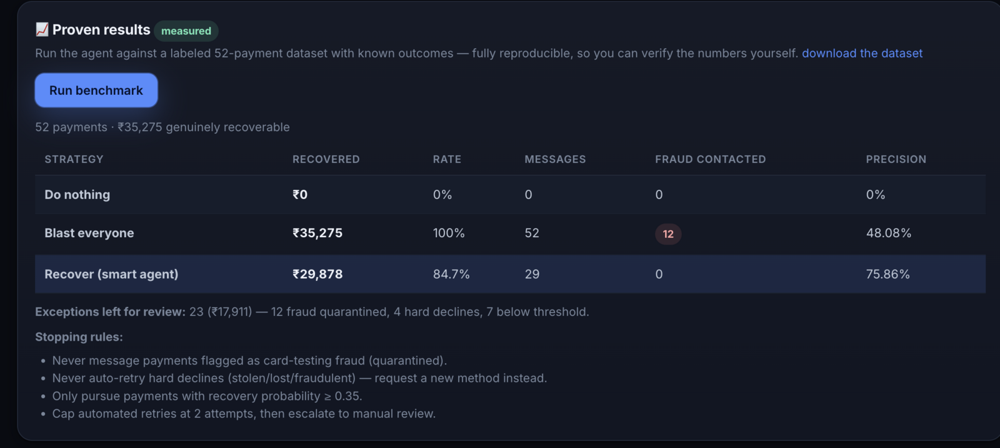
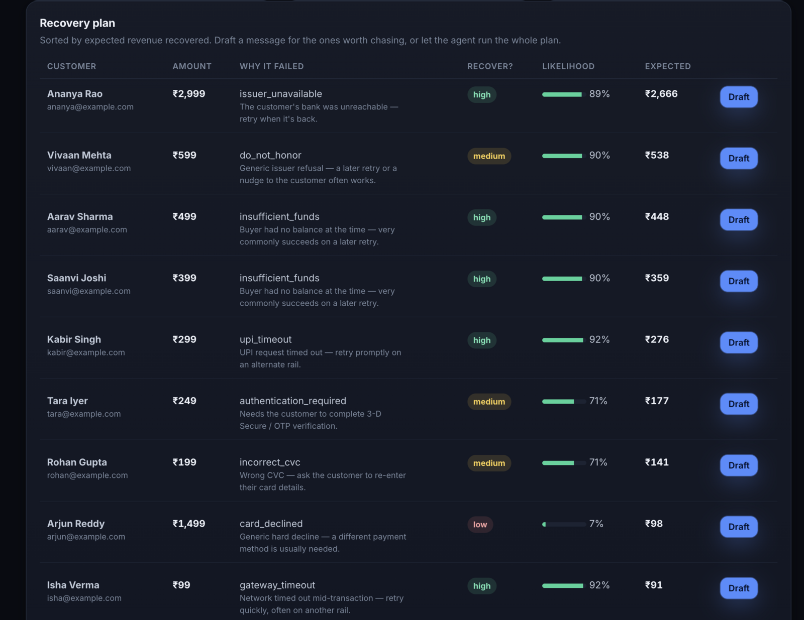
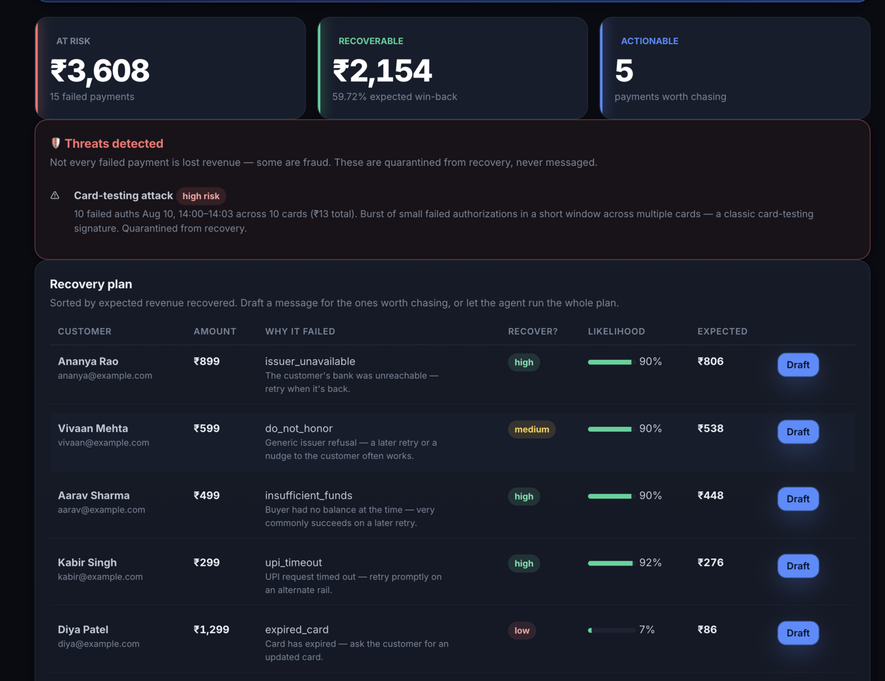
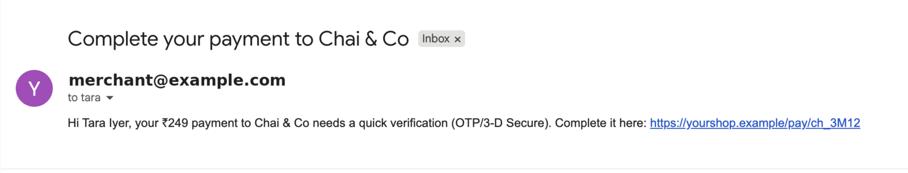
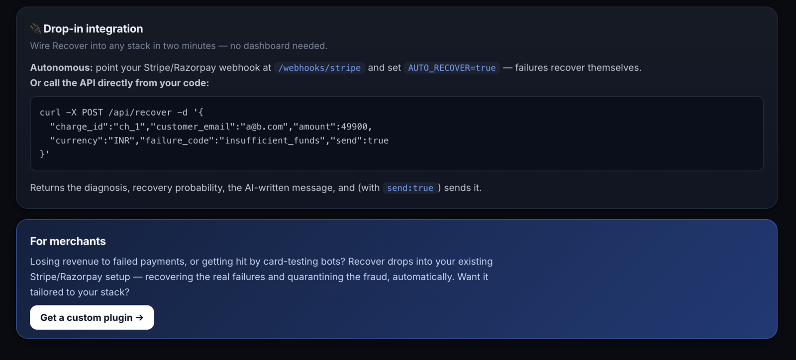

<div align="center">

# 💸 Recover

### An AI agent that wins back revenue from failed payments — and refuses to message the fraudsters hiding in them.

[](https://go.dev)
[](go.mod)
[](#3-live-stripe-webhooks-real-events)
[](Dockerfile)

**[Live demo](#) · [Quickstart](#quickstart) · [Measured results](#measured-results) · [Drop-in API](#4-drop-in-api)**

</div>



---

## The problem

A payment fails. Most small businesses never find out why, never follow up, and quietly
lose the sale. The ones that do follow up email *everybody* who failed — including the
fraudster who just ran forty stolen cards through their checkout.

**Recover** reads a merchant's failed payments and decides, per payment, whether there is
real money to win back and what to do about it:

```
observe                    decide                            act
───────                    ──────                            ───
CSV upload      ──▶   diagnose the decline code    ──▶   send the recovery message
Stripe webhook  ──▶   score P(recover)             ──▶   schedule a retry
                      detect card-testing bursts   ──▶   quarantine · never message
```

The headline number it computes for a merchant is the only one that matters:

> **Expected recoverable revenue = Σ P(recover) × amount**

---

## What makes it real

This is the part I care most about, so it goes above everything else.

| Layer | What's actually real |
|---|---|
| **Diagnosis** | Documented card-network decline behaviour. Soft declines (`insufficient_funds`, `issuer_unavailable`) retry in a smart window; hard declines (`lost_card`, `stolen_card`) never retry and request a new method; data errors need customer action. 17 real Stripe/Razorpay failure codes, each with an auditable action. |
| **Scoring** | Logistic regression over the diagnosis, amount, and contact availability. Ships with weights derived from real decline behaviour, and **trains on your outcomes** if your CSV has a `recovered` column. |
| **Input** | Any real Stripe/Razorpay-style export — or live, signature-verified `charge.failed` events straight from Stripe test mode. |
| **Output** | A real message, over real SMTP, to a real inbox. |
| **Results** | A labeled 52-payment dataset ships with the repo. `GET /benchmark` reproduces every number below on your machine. |

**The honest limit:** silently *re-charging* a card needs live gateway credentials and
stored mandates, so the agent schedules the retry rather than executing it. Everything up
to and including sending the recovery message is real. Outreach-based recovery — dunning —
is a real paid product category on its own, not a stand-in for one.

---

## Measured results

Not "expected." Measured, against ground truth, reproducible with one HTTP call.

```bash
curl localhost:8090/benchmark
```

| Strategy | Recovered | Rate | Messages sent | Fraudsters contacted | Precision |
|---|---:|---:|---:|---:|---:|
| Do nothing | ₹0 | 0% | 0 | 0 | — |
| Blast everyone | ₹35,275 | 100% | 52 | **12** | 48.1% |
| **Recover (agent)** | ₹29,878 | **84.7%** | **29** | **0** | **75.9%** |

**Read this table honestly: the agent does not out-recover blast-everyone on raw rupees.**
It captures 84.7% of the recoverable money using 44% fewer messages and contacting zero
fraudsters. That gap is the entire point — the agent has judgment about *who* to pursue,
and judgment costs you the long tail.

The 23 payments it declined to chase break down as: 12 quarantined as card-testing fraud,
4 hard declines routed to a new-payment-method request, 7 below the 0.35 probability
threshold.



### Stopping rules

The agent is explicit about what it will not do:

- Never message payments flagged as card-testing fraud.
- Never auto-retry hard declines (stolen, lost, fraudulent) — request a new method instead.
- Only pursue payments with recovery probability ≥ 0.35.
- Cap automated retries at 2 attempts, then escalate to manual review.

---

## Quickstart

```bash
make run          # → http://localhost:8090
```

Zero dependencies, standard library only. Drop `sample_failed_payments.csv` into the
uploader and you have a full recovery plan in a second — no keys, no config. Messages fall
back to templates so the app is fully usable before you configure anything.

**Docker:**

```bash
docker build -t recover .
docker run -p 8090:8090 -e HF_TOKEN=$HF_TOKEN recover
```

**Configuration** — copy and fill:

```bash
cp env.example.sh env.sh   # env.sh is gitignored; never commit real secrets
source env.sh && make run
```

<details>
<summary><b>Environment variables</b> (all optional — the app runs with none of them)</summary>

<br>

| Variable | Effect |
|---|---|
| `HF_TOKEN` | Enables LLM-written messages via Hugging Face. Without it, templates. |
| `HF_MODEL` | Chat model to use. Default `Qwen/Qwen2.5-72B-Instruct`. |
| `SMTP_HOST` `SMTP_USER` `SMTP_PASS` `SMTP_FROM` | Real email sending. Gmail needs an App Password. |
| `SMTP_PORT` | Default `587`. |
| `MERCHANT_NAME` `MERCHANT_PAY_LINK` | Branding inside the recovery message. |
| `STRIPE_WEBHOOK_SECRET` | Enables HMAC signature verification on incoming webhooks. |
| `AUTO_RECOVER` | `true` = recover every incoming webhook failure with no dashboard, no human. |
| `TEST_RECIPIENT` | Routes every message to one address so you can watch them arrive. |
| `TWILIO_ACCOUNT_SID` `TWILIO_AUTH_TOKEN` `TWILIO_FROM` | SMS/WhatsApp. See the note in [limitations](#known-limitations). |

</details>

---

## Four ways to run it

### 1. Upload a CSV

The merchant path. Drop in a Stripe or Razorpay export and get a plan sorted by expected
recoverable revenue — biggest wins first.

```
charge_id, created_at, amount, currency, payment_method,
failure_code, customer_email, customer_name [, recovered]
```

Extra columns are ignored. Amounts are in the smallest unit (paise/cents). A `recovered`
column, if present, trains the model on your real outcomes.



### 2. Watch it refuse to message a fraudster

Click **"try attack sample"** in the app, or:

```bash
curl -X POST localhost:8090/analyze --data-binary @web/sample_with_attack.csv
```

Real output from that file:

```json
{
  "kind": "card_testing",
  "window_start": "Aug 10, 14:00",
  "window_end": "14:03",
  "count": 10,
  "distinct_customers": 10,
  "total_amount": 1250,
  "risk": "high",
  "explanation": "Burst of small failed authorizations in a short window across
                  multiple cards — a classic card-testing signature.
                  Quarantined from recovery."
}
```

Ten failures, ten different cards, three minutes, ₹12.50 total. That is not a customer
having a bad day — that is someone checking which stolen numbers still work. All ten rows
are excluded from recoverable revenue and never messaged.



### 3. Live Stripe webhooks (real events)

```bash
stripe login
stripe listen --forward-to localhost:8090/webhooks/stripe
#   → prints whsec_...
export STRIPE_WEBHOOK_SECRET=whsec_...
make run

# in another shell:
stripe trigger charge.failed
```

The failure appears in the **Live** panel within a second — diagnosed, scored, ready to
recover. Signatures are verified with Stripe's real scheme: HMAC-SHA256 over
`"{timestamp}.{payload}"`, constant-time compared against the `v1` value in the
`Stripe-Signature` header.

Set `AUTO_RECOVER=true` and it skips the dashboard entirely — every incoming failure is
diagnosed, scored, and recovered autonomously.

### 4. Drop-in API

One endpoint, one payment, one response. This is the "wire it into your existing checkout
in five minutes" path.

```bash
curl -X POST localhost:8090/api/recover \
  -H 'Content-Type: application/json' \
  -d '{"charge_id":"ch_1","customer_name":"Aarav","customer_email":"a@b.com",
       "amount":49900,"currency":"INR","failure_code":"insufficient_funds"}'
```

Real response:

```json
{
  "charge_id": "ch_1",
  "diagnosis": {
    "bucket": "soft_decline",
    "recoverable": "high",
    "action": "retry_scheduled",
    "retry_window": "in 24–72h (near payday)",
    "reason": "Buyer had no balance at the time — very commonly succeeds on a later retry."
  },
  "p_recover": 0.9,
  "expected_recovered": 44832.29,
  "message": "Hi Aarav, your ₹499 payment to Chai & Co didn't go through — looks like a
              temporary issue. We'll retry it shortly, or you can complete it now:
              https://chaiandco.example/pay/ch_1",
  "mode": "template"
}
```

Add `"send": true` and it sends. The `mode` field tells you honestly whether the LLM wrote
the message or the template did — it never silently pretends the AI ran.

A real recovery email, sent by the agent over SMTP, arriving in a real inbox:



---

## Recover as a component

It isn't only a dashboard. The same agent drops into an existing stack two ways — point a
webhook at it and set `AUTO_RECOVER=true`, or call `/api/recover` directly from your
checkout code. The app documents both inline, so a developer evaluating it never has to
leave the page.



For merchants who don't want to run anything themselves, the same core adapts to a
specific stack — the failure taxonomy and card-testing thresholds are the parts worth
tuning per business, since a subscription service and a one-off storefront fail in very
different shapes.

---

## Architecture

A single Go binary. No framework, no queue, no sidecar.

```
cmd/server/
├── main.go        CSV pipeline, JSON API, HTTP server, panic recovery
├── diagnose.go    DECIDE — 17 decline codes → bucket, action, retry window
├── model.go       DECIDE — logistic regression, P(recover), trainable on labels
├── fraud.go       DECIDE — card-testing burst detection + quarantine
├── draft.go       ACT     — LLM message generation, template fallback
├── executor.go    ACT     — real SMTP/Twilio sends, retry scheduling, rate limiting
├── webhook.go     OBSERVE — signature-verified Stripe ingestion, AUTO_RECOVER
├── benchmark.go   measured strategy comparison against labeled ground truth
├── metrics.go     live session counters (real, not decorative)
└── sim.go         synthetic traffic through the REAL pipeline, labeled SIMULATED
web/               single-page dashboard
```

<details>
<summary><b>All endpoints</b></summary>

<br>

| Method | Path | Purpose |
|---|---|---|
| `POST` | `/analyze` | CSV → diagnosed, scored, prioritized plan + detected threats |
| `POST` | `/draft` | One payment → recovery message |
| `POST` | `/execute` | Run the approved plan (rate-limited, 10/min per IP, 100-row cap) |
| `POST` | `/api/recover` | Drop-in single-payment endpoint |
| `POST` | `/webhooks/stripe` | Live signature-verified Stripe events |
| `GET` | `/live` | Live failure feed |
| `GET` | `/overview` | Session metrics + activity series |
| `POST` | `/simulate` | One synthetic event through the real pipeline |
| `GET` | `/benchmark` | Reproducible measured results |
| `GET` | `/health` | Liveness |

</details>

### Design decisions

- **Outreach, not silent auto-retry.** Re-charging needs live gateway credentials and
  stored mandates. Outreach with a pay-again link is fully real without them, so the demo
  does real work on real data instead of miming it.
- **Rules for correctness, model for ranking.** The decline table decides *what to do* and
  is auditable line by line. The model only decides *what to do first*. Putting an ML model
  in charge of "should we retry a stolen card" would be a worse product.
- **Never depend on the LLM.** Templates are the floor, and they're good messages. The LLM
  is an upgrade, and the response tells you which one you got.
- **One Go service, stdlib only.** I was handed a microservices + RabbitMQ + Helm + HPA
  design and turned it down. It would not have made the product more useful and it would
  have risked not shipping. Kubernetes is a roadmap item, not a v1 requirement.

---

## Safe to share publicly

- **Demo mode** — type your own phone or email in the app and every message routes to you,
  so a reviewer can trigger a real recovery run and receive it themselves.
- Per-IP rate limiting on `/execute` (10 runs/min), 100-row cap per run.
- Panic recovery middleware — a malformed upload can't take the server down.
- Secrets are server-side env vars only. `env.sh` is gitignored; no token ever reaches the
  browser.
- Simulated traffic is labeled **SIMULATED** in the UI and never mixed into real counters.

---

## Known limitations

Listed because you'd find them anyway:

- **Card re-charge is scheduled, not executed** — needs gateway credentials and mandates.
- **Twilio SMS is wired but unusable on a trial account** — trials block custom message
  templates, so email is the demo channel. The code path is complete and works with a paid
  account.
- **Session metrics are in-memory** — they reset on restart. No database by design.
- **Fraud detection needs `created_at`** — rows without a parseable timestamp are skipped
  by the burst detector.
- **No auth or multi-tenancy** — single-merchant demo, not a production SaaS.

## Roadmap

Real card re-charge via gateway APIs · opt-out and compliance handling · persistence ·
auth and multi-tenancy.

---

<div align="center">
<sub>Built in Go, with judgment about what to leave out.</sub>
</div>
